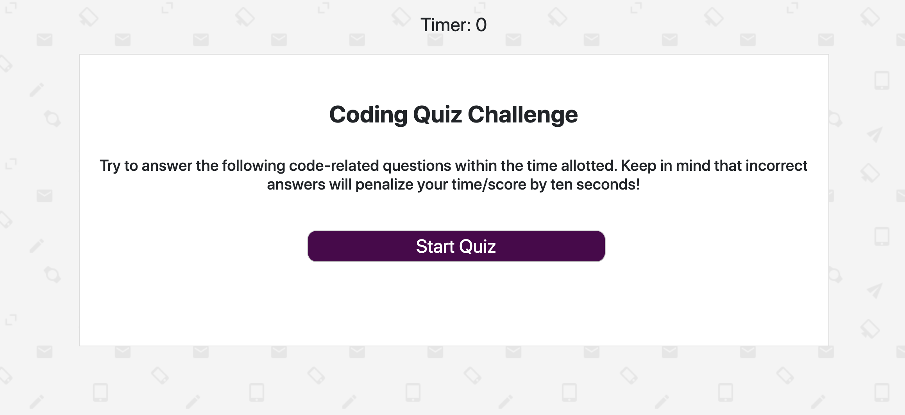

# Code Quiz
## User Story
As a coding bootcamp student
I want to take a timed quiz on coding fundamentals that stores high scores
So that I can gauge my progress compared to my peers

## Description and Usage
This quiz was built to test the user's knowlege of code! 

Upon clicking the start button, the code quiz takes the user through a series of five code related questions. If the user gets a question correct a message will appear on the screen that says "Correct!", however if the user gets a question wrong the message with say "Wrong!" and the user's time will be deducted by 10 seconds. 

If time reaches "0" before all the questions can be answered, the game is over and the user's score will be "0". If all the questions are answered and there is still time left on the clock, that time will now equal the user's score. 

At the end of the questions the user will be able to document their scores by typing their initials into a form and submitting them to the High Scores board. Clicking the "Clear Scores" button will erase all the scores from the roster. Clicking the "Go Back" button will bring the user to the start page where they can take the quiz again and try to beat their previous score.

[Click here to test your knowledge of code!](https://ashleyw27.github.io/code_quiz/)

## Technology
* HTML
* CSS
* Bootstrap
* JavaScript
  
## What I Learned
I learned many new concepts and skills while creating this code quiz. A few of which include:
* The difference between global variables and local variables and how each can be used
* Functions should not be nested inside Events
* Committing early and often is very important!
* How to set the attribute of a variable in JavaScript
* The benefits of JSON stringify and parse
