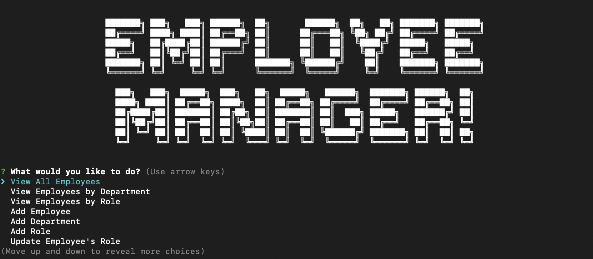

# Employee Management System
## Description and Usage
The Employee Management System can be used to view, create, and update employees within the system to ensure all critical employee information stays up-to-date.
The user can choose from multiple menu options (outlined below) to select the action they would like to perform within the application.
* **View All Employees** - All employee information, including first name, last name, manager id, title, salary, and departmemt will display for each employee in the system
* **View Employees by Department** - All employee information will display for the employees included in the department selected by the user
* **View Employees by Role** - All employee information will disply for the employees included in the role selected by the user
* **Add Employee** - Allows the user to add a new employee to the Employee Management System
* **Add Department** - Allows the user to add a new department to the Employee Management System
* **Add Role** - Allows the user to add a new role to the Employee Management System
* **Update Employee's Role** - Allows the user to update the role of an existing employee
* **Quit** - Allows the user to exit the application

## Technology
* MySQL
* Node.js
* Database Queries
  
## What I Learned
I learned many new concepts and skills while creating this employee management system. A few of which include:
* How to create a database
* CRUD
* Inner Joins
* How to create a query string
* How to connect to a database
* The proper syntax for a Schema and Seed file
