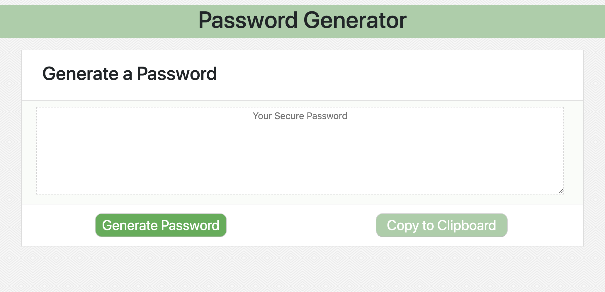

# Password Generator
## User Story
As an employee with access to sensitive data

I want to randomly generate a password that meets certain criteria

So that I can create a strong password that provides greater security

## Description and Usage
This tool was built to generate a password based on the users preferences including password length and the types of characters that the user would like included in the password (symbols, numbers, lower case letters, and/or upper case letters). To run the program the user will press the *Generate Password* button and a prompt will appear on the page asking the user to specify the desired length of their password. The user must choose between 8 and 128 characters. If they choose outside of those parameters they will receive an alert asking them to choose again. 

Once a password length is chosen the user will be asked to confirm the types of characters their password should include. If the user clicks *OK* that character will appear in their password. If the user clicks *Cancel* that character will not appear in their password. 

After all the parameters are chosen a randomized password will appear on the screen for the user to utilize. The user can simply copy the password by clicking the *Copy to Clipboard* button.

Below is a snapshot of this simple and easy-to-opporate password generator. As well as a link to the generator itself. Feel free to try it out!

[Click here to try the Password Generator!](https://ashleyw27.github.io/password_generator/)

## Technology
* HTML
* CSS
* Bootstrap
* JavaScript
  
## What I Learned
I learned many new concepts and skills while creating this password generator. A few of which include:
* How functions work (the function must be declared and then called)
* The best uses for For Loops
* What variables are and how to declare them
* What an index is and the proper way to count indices (starting from 0)
* The benefits of arrays and how to structure arrays
