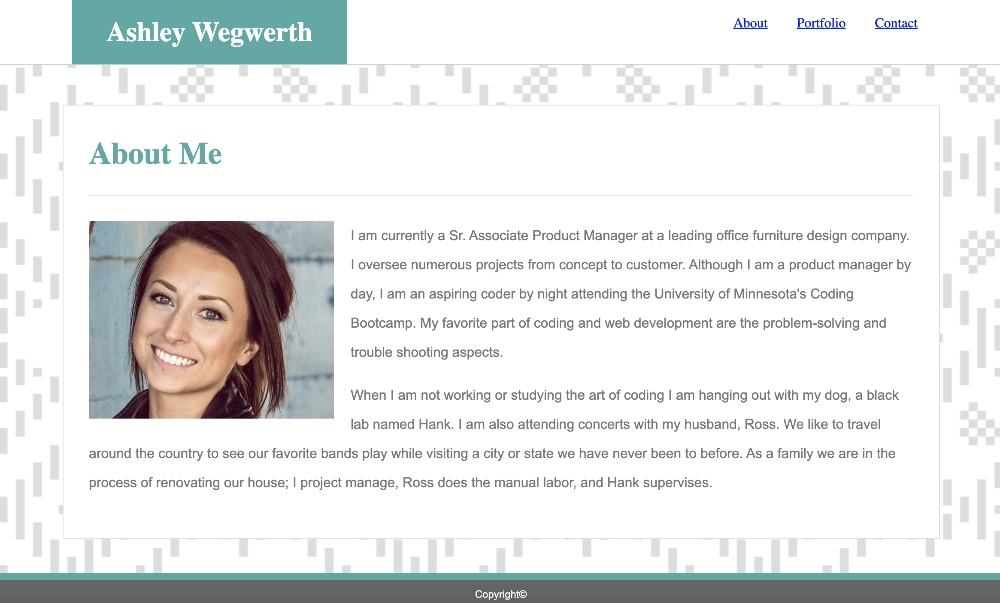

# Portfolio
## User Story
As a web developer

I want a deployed portfolio

So that I can showcase my applications to potential employers and clients

## Description
This portfolio serves multiple purposes. It shares a little bit about me in the **About** section, including a short desctiption of my current capabilities, why I love coding, and what I do for fun. It will soon showcase my abilities as a coder through projects I will complete which will be able to be viewed in the **Portfolio** section. Finally, it will give readers the ability to contact me via a form in the **Contact** section. 

[Click here to view the Portfolio!](https://ashleyw27.github.io/portfolio/)

## Technology
The languages used to create this page are HTML and CSS.

## What I Learned
I learned many new skills creating this Profile. A few of which include:
* HTML Syntax
* CSS Syntax
* The box-model
* Floats
* Sticky Footer
* Deploying
