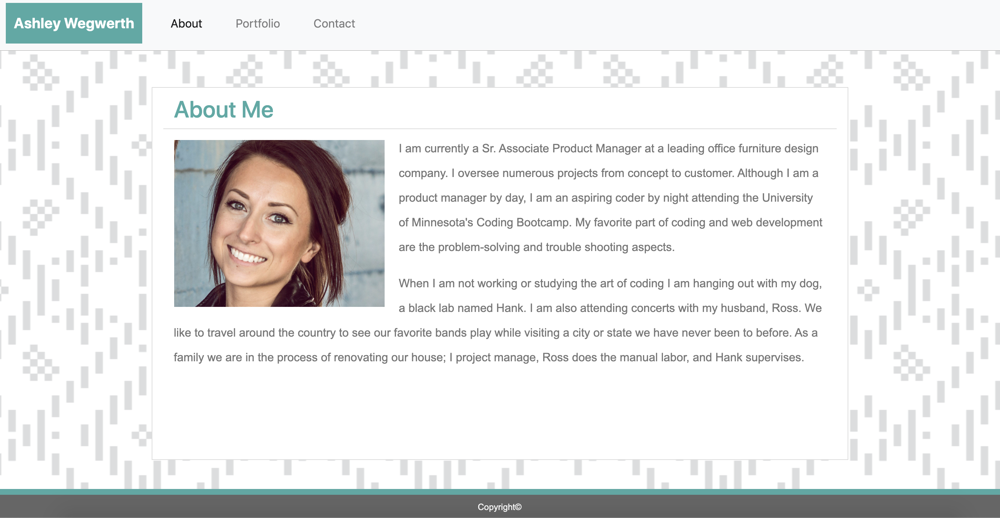

# Responsive Portfolio
## User Story
As a web developer

I want a responsive deployed portfolio

So that I can showcase my responsive applications to potential employers and clients

## Description
This responsive portfolio is a replica of my original portfolio I created, but includes a few tweaks. I utilized a bootstrap CDN link within my 'head' tag which allowed me to utilize bootstrap's built-in responsiveness as well as incorporate bootstrap components within my code. Some of these components include a navbar and a contact form.

[Click here to view the Responsive Portfolio!](https://ashleyw27.github.io/responsive_portfolio/)

## Technology
* HTML
* CSS
* Bootstrap

## What I Learned
I learned many new concepts and skills while creating this responsive portfolio. A few of which include:
* The benefits of bootstrap
* How and where to add a bootstrap CDN link
* How to incorporate bootstrap components
* How to manipulate the pre-defined CSS that comes along with bootstrap
* How to use devtools to inspect my code
* Media Queries
