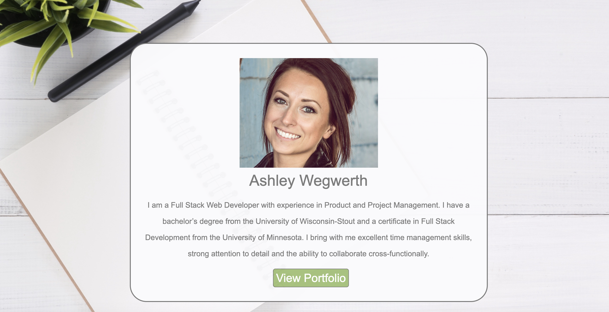

# Portfolio
## Description
Developer portfolio featuring a **Home** page with my brand statement and link to my full portfolio. Clicking the "View Portfolio" link will bring you to an **About** page which will provide you with a little info about me and my life. The navigation bar at the top of this page will bring you to different parts of my portfolio. It includes links to my projects, contact information, and will also lead you back to my home page by clicking my name (**Ashley Wegwerth**). **Projects** showcases my coding abilities through some of the work I have done. **Contact** provides my contact information (email and phone), a link to my resume, as well as my Social Media links (LinkedIn and GitHub). Click the link below to view my full portfolio!

[Click here to view my portfolio!](https://ashleyw27.github.io/updated_portfolio/home.html)

## Technology
* HTML
* CSS
* Bootstrap
* Google Fonts
* FontAwesome
* Animate.css
