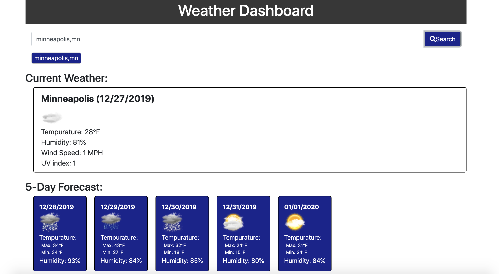

# Updated Weather Dashboard
## Updates
The updates made to the Weather Dashboard include:
* Cleaner code - functions were added to reduce repetitiveness
* The weather data of the last city searched now populates upon page load
------------------------------------------------------------------------------------------------------------------------------
## User Story
As a traveler

I want to see the weather outlook for multiple cities

So that I can plan a trip accordingly

## Description and Usage
This weather dashboard is powered by the AerisWeather API (a company located right here in Minnesota!). By typing a city and state code (Ex: minneapolis,mn) into the search field and clicking the "Search" button the current weather and 5-day forecast will be returned to you for that particular city. The current weather includes the tempurature, humidity, wind speed, and UV index. The 5-day forecast includes the max and min temperature and average humidity for that day.

You will notice that once you have searched for a city, the name of that city will appear directly under the search bar. If you want to view that cities forecast again, simply click on the city name and its weather information will be returned to you. Even after reloading the page your previously searched cities will be availabe for you to view and click to obtain the weather forecast.

[Click here to check the weather!](https://ashleyw27.github.io/updated_weather_dashboard/)

## Technology
* HTML
* CSS
* Bootstrap
* jQuery
* AJAX
* API
* Moment.js library
  
## What I Learned
I learned many new concepts and skills while creating this weather dashboard. A few of which include:
* How to hard code information into an API query string
* How to make an AJAX call
* API's are awesome!
